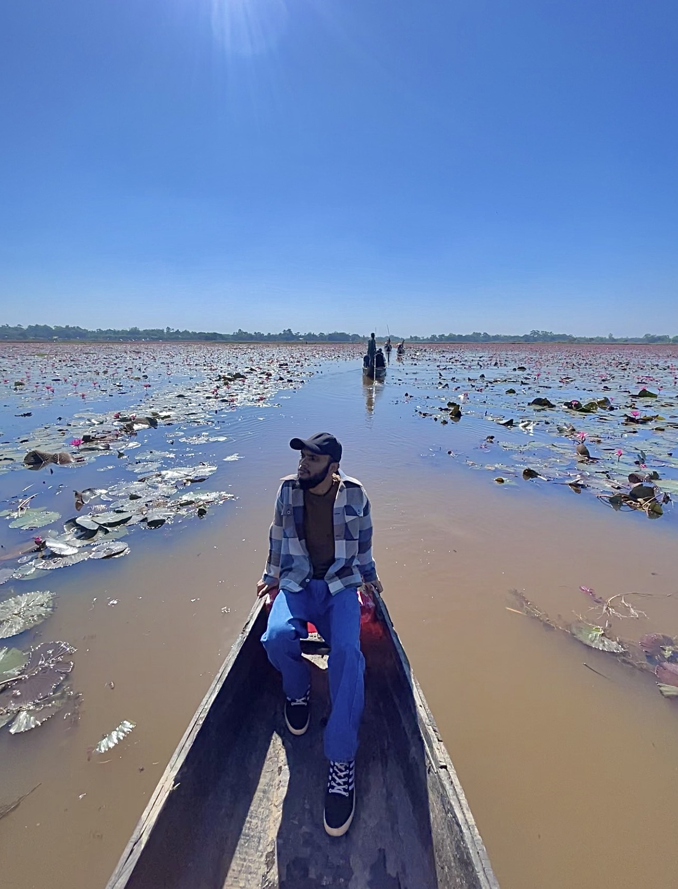

# Hi, I'm Bikash Talukder

### Open Source Enthusiast | Lifelong Learner | Building AI-powered systems that ship

---

### Currently Focused On

- Building production-grade AI microservices (hybrid rule-based + LLM architectures)
- Fine-tuning small language models (LoRA/QLoRA) for domain-specific reasoning
- Bilingual (Bangla/English/Banglish) NLU and offline-first PWAs
- Edge computing with Cloudflare Workers, Workers AI, and Vectorize
- Secure authentication with JWT and Better Auth

---

### Achievements

**2nd Place — bKash presents SUST CSE Carnival 2026: Codex Community Hackathon (Preliminary Round)**
Out of 750+ registered teams nationwide, Team **The Bug Busters** (Metropolitan University) secured 2nd position and a spot in the **Top 50 Main Arena** — competing for a 22 Lac+ BDT prize pool.

Built **QueueStorm Investigator** in 4.5 hours: a safety-first, deterministic AI microservice for bKash that classifies and triages customer complaints written in Bengali, English, and Banglish. Featured hybrid rule-based + LLM architecture, prompt-injection and phishing guardrails, evidence matching, structured logging, and idempotency caching — deployed as a production FastAPI service with full OpenAPI docs.

---

### Tech Stack

**Frontend**

**Backend**

**AI / ML**

**Database**

**Auth & Security**

**Cloud & DevOps**

---

### Featured Projects

<table>
<tr>
<td width="50%">

**[CENDRIX AI](https://cendrix-ai.vercel.app/)**
Next-gen intelligent learning platform with an IDE-grade editor, side-by-side LLM benchmarking, D3.js visualization lab (mind maps, algorithm visualizer, math plotter, code trace), and a 3-tier resilient inference architecture (Cloudflare → OpenRouter → Pollinations). Includes a custom QLoRA fine-tuned TinyLlama model.

</td>
<td width="50%">

**[Rentify — AI Car Rental System](https://web-production-377eb.up.railway.app/)**
Java 17 + Spring Boot 3 car rental platform with a live, data-grounded AI assistant. Context-injection architecture queries the database in real time so answers reflect actual fleet, pricing, and revenue — zero hallucinated numbers.

</td>
</tr>
<tr>
<td width="50%">

**[Healthcare Triage AI](https://rural-health-triage-nine.vercel.app/)**
Offline-capable, bilingual (Bangla/English) PWA for rural community health workers. Features voice intake, automated vitals anomaly detection, prescription OCR, and adaptive LLM triage routing.

</td>
<td width="50%">

**[QueueStorm Investigator](https://final-mock-test-sust-hackathon.onrender.com/)**
Safety-first, deterministic AI microservice built for the bKash SUST Hackathon. Parses free-form customer complaints (English/Bengali/Banglish) into structured triage data using a hybrid rule + LLM architecture, with prompt-injection and phishing guardrails.

</td>
</tr>
<tr>
<td width="50%">

**[Cognexa AI](https://cognexa-ai.vercel.app/)**
Authless, zero-signup AI chat assistant and voice playground. Monorepo with a FastAPI backend, fallback provider chain, local document extraction (OCR/PDF), and a glass-morphic React SPA.

</td>
<td width="50%">

**[Nexora — Your AI Companion](https://old-ai-code.vercel.app/)**
An AI companion web app focused on conversational experience and responsive design.

</td>
</tr>
<tr>
<td width="50%">

**[Coffeeshop E-Commerce](https://coffeshop-e-commerce-website.vercel.app/)**
High-performance, viral-aesthetic coffee shop e-commerce platform with smooth motion design, AI-powered features, and an edge-optimized RAG system. Built with Vite, deployed seamlessly across platforms.

</td>
<td width="50%">

**[Cake E-Commerce Website](https://cake-e-commerce-website-henna.vercel.app/)**
Premium artisan cake ordering platform for a home-based cake studio, built with React, TypeScript, and Tailwind CSS, with WhatsApp checkout integration.

</td>
</tr>
</table>

---

### GitHub Stats

---

Reach me at **bikashtalukder040@gmail.com**

